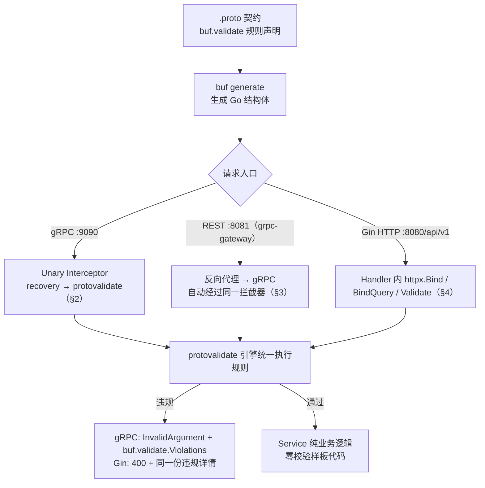

# 代码层范式：零手写校验、三态读写与 AIP 用法

> 目标：**业务代码中零手写参数校验**（严禁 `if req.Username == ""` 式样板代码），校验规则 100% 由契约（`buf.validate`）声明、由 protovalidate 引擎统一执行。
>
> 本文所有代码均取自本仓库真实实现（路径、结构体名、函数签名一致），可直接对照阅读：
> `cmd/server/main.go`、`internal/user/{model,service,handler,server}.go`、`internal/todo/{model,service}.go`、`internal/platform/aipgorm/aipgorm.go`。

| 元数据 | 值 |
|---|---|
| Go 版本 | 1.26.2 |
| 校验引擎 | protovalidate（`buf.build/go/protovalidate` v1.4.0） |
| gRPC 中间件 | go-grpc-middleware/v2 v2.3.4（protovalidate / recovery 拦截器） |
| AIP 能力 | `go.einride.tech/aip` v0.86.3（pagination / filtering / ordering / fieldmask） |

---

## 0. 校验架构总览



三条入口**共用同一份契约规则**，业务代码里没有任何 `if` 校验。

---

## 1. 生成代码速览：`optional` 与 `update_mask`

```go
// gen/go/user/v1/user.pb.go（protoc-gen-go  v1.36.12 生成，节选）
type UpdateUserRequest struct {
    UserId     string                  // 普通标量：无 presence
    Nickname   *string                 // optional string → *string
    Phone      *string                 // optional string → *string
    AvatarUrl  *string                 // optional string → *string
    Status     *UserStatus             // optional enum   → *UserStatus
    UpdateMask *fieldmaskpb.FieldMask  // AIP-134 字段掩码
}

// nil 安全 Getter：字段未传递时返回零值，永不 panic
func (x *UpdateUserRequest) GetNickname() string { ... }

// 三态判定：仅 optional 字段生成 Has* 方法
func (x *UpdateUserRequest) HasNickname() bool { return x.Nickname != nil }
```

> protovalidate 引擎读的正是 `user.pb.go` 内嵌的规则描述符，业务侧无需注册任何规则。

---

## 2. gRPC：全局拦截器零侵入（生产形态）

真实实现：`cmd/server/main.go` 的 `provideGRPCServer`。

```go
// provideGRPCServer 构建 gRPC Server：拦截器链为 recovery → protovalidate（契约校验）。
// 校验规则来自 .proto 中的 buf.validate，业务代码零手写校验。
func provideGRPCServer(log *slog.Logger) (*grpc.Server, error) {
	validator, err := protovalidate.New()
	if err != nil {
		return nil, err
	}
	log.Debug("protovalidate interceptor enabled")
	return grpc.NewServer(
		grpc.ChainUnaryInterceptor(
			recovery.UnaryServerInterceptor(),                            // 1. 最外层：panic 兜底
			protovalidatemw.UnaryServerInterceptor(validator),            // 2. 契约校验
		),
	), nil
}
```

- **`protovalidate.New()` 必须复用**：它会编译全部规则描述符，开销大。本仓库在 `provideGRPCServer` 里构建一次并传入拦截器（Gin 侧同理，`internal/user/handler.go` 的 `NewHandler` 也只构建一次）。
- **链序原则**：recovery 最外层（兜住所有 panic）→ 校验次之（非法请求不消耗下游资源）→ 认证/鉴权 → 业务。

### 2.1 gRPC 服务实现只写业务

真实实现：`internal/user/server.go`。

```go
// Server 实现 user.v1.UserServiceServer（gRPC）。
// 入参校验不在此手写：由 protovalidate 拦截器统一执行。
type Server struct {
	userv1.UnimplementedUserServiceServer
	svc *Service
}

func NewServer(svc *Service) *Server { return &Server{svc: svc} }

func (s *Server) GetUser(ctx context.Context, req *userv1.GetUserRequest) (*userv1.GetUserResponse, error) {
	u, err := s.svc.GetUser(ctx, req.GetUserId())
	if err != nil {
		return nil, gRPCError(err)
	}
	return &userv1.GetUserResponse{User: u}, nil
}

// gRPCError 将领域错误映射为 gRPC 标准状态码。
func gRPCError(err error) error {
	switch {
	case errors.Is(err, ErrNotFound):
		return status.Error(codes.NotFound, err.Error())
	case errors.Is(err, ErrInvalidArgument):
		return status.Error(codes.InvalidArgument, err.Error())
	case errors.Is(err, ErrInvalidCredentials):
		return status.Error(codes.Unauthenticated, err.Error())
	case errors.Is(err, ErrDuplicateUser):
		return status.Error(codes.AlreadyExists, err.Error())
	default:
		return status.Error(codes.Internal, "internal server error")
	}
}
```

校验失败由拦截器直接返回 `InvalidArgument` + `buf.validate.Violations` 详情，Handler 不会被触达。

---

## 3. grpc-gateway：REST 自动覆盖同一套规则

真实实现：`cmd/server/main.go` 的 `newGateway`。

```go
func newGateway(grpcEndpoint string) (http.Handler, error) {
	mux := runtime.NewServeMux(
		runtime.WithMarshalerOption(runtime.MIMEWildcard, &runtime.JSONPb{
			MarshalOptions: protojson.MarshalOptions{EmitUnpopulated: false},
		}),
	)
	opts := []grpc.DialOption{grpc.WithTransportCredentials(insecure.NewCredentials())}
	ctx := context.Background()

	if err := todov1.RegisterTodoServiceHandlerFromEndpoint(ctx, mux, grpcEndpoint, opts); err != nil {
		return nil, err
	}
	if err := userv1.RegisterUserServiceHandlerFromEndpoint(ctx, mux, grpcEndpoint, opts); err != nil {
		return nil, err
	}
	return mux, nil
}
```

> ⚠️ **必须关闭 `EmitUnpopulated`**：grpc-gateway 默认会输出未填充字段，这会让 `user.v1.User.password_hash` 以 `"passwordHash":""` 出现在响应里——虽然值恒空，但字段名本身不应外泄。关闭后与 Gin 侧（protojson 默认行为）保持一致。

REST 请求被反向代理成 gRPC 调用，因此 §2 的拦截器同样覆盖 REST。

---

## 4. Gin HTTP Handler：`protojson` + protovalidate

真实实现：`internal/user/handler.go`（`internal/todo/handler.go` 同构）。

```go
type Handler struct {
	svc      *Service
	log      *slog.Logger
	validate httpx.Validator // wire 注入，进程内共享一份（不再各 Handler 自建）
}

func NewHandler(svc *Service, validate httpx.Validator, log *slog.Logger) *Handler {
	return &Handler{svc: svc, log: log, validate: validate}
}

func (h *Handler) UpdateUser(c *gin.Context) {
	var req userv1.UpdateUserRequest
	// 先读 body，再补路径参数，最后统一校验：
	// 顺序颠倒会让 user_id 的 uuid 规则对空值报错（httpx.Bind 的注释有同样提醒）。
	if !httpx.ReadBody(c, &req) {
		return
	}
	req.UserId = c.Param("user_id")
	if !httpx.Validate(c, h.validate, &req) {
		return
	}

	u, err := h.svc.UpdateUser(c.Request.Context(), &req)
	if err != nil {
		httpx.WriteMapped(c, h.log, err) // 状态码来自 errorsx，handler 不再逐 case 列举
		return
	}
	httpx.WriteProto(c, http.StatusOK, &userv1.UpdateUserResponse{User: u})
}

// ListUsers 处理 GET /api/v1/users —— query 绑定交给 httpx.BindQuery
func (h *Handler) ListUsers(c *gin.Context) {
	req := &userv1.ListUsersRequest{}
	if !httpx.BindQuery(c, req) || !httpx.Validate(c, h.validate, req) {
		return
	}
	users, next, err := h.svc.ListUsers(c.Request.Context(), req)
	if err != nil {
		httpx.WriteMapped(c, h.log, err)
		return
	}
	httpx.WriteProto(c, http.StatusOK, &userv1.ListUsersResponse{Users: users, NextPageToken: next})
}
```

上面用到的 `httpx.*` 全部来自 `internal/platform/httpx`：

| 函数 | 作用 |
|---|---|
| `ReadBody` | 只反序列化（protojson，兼容 snake_case / lowerCamel 与枚举名），不校验 |
| `Validate` | 执行契约中声明的 `buf.validate` 规则 |
| `Bind` | `ReadBody` + `Validate`，仅用于**无需补路径参数**的场景 |
| `BindQuery` | query → proto（复用 grpc-gateway 解析器，与 gateway 入口语义一致） |
| `WriteProto` / `WriteError` | 输出 Proto JSON / `{code,message}` |
| `WriteMapped` | 领域错误 → 状态码（映射规则由 `errorsx` 在声明处固化） |

**领域错误 → 状态码**：映射不再写在 handler 里，而是在 `internal/platform/errorsx` 的**声明处**固化：

```go
var (
	ErrNotFound           = errorsx.New("USER_NOT_FOUND", "user not found", http.StatusNotFound, codes.NotFound)
	ErrInvalidArgument    = errorsx.New("INVALID_ARGUMENT", "invalid argument", http.StatusBadRequest, codes.InvalidArgument)
	ErrInvalidCredentials = errorsx.New("USER_INVALID_CREDENTIALS", "invalid username or password",
		http.StatusUnauthorized, codes.Unauthenticated)
	ErrDuplicateUser      = errorsx.New("USER_ALREADY_EXISTS", "username or email already exists",
		http.StatusConflict, codes.AlreadyExists)
)
```

gRPC 侧由 `errorsx.UnaryServerInterceptor()` 统一转换（链序 `errorsx → recovery → protovalidate`），
因此 `server.go` 里每个方法只需要 `return nil, err`。

---

## 5. 三态读写与 `update_mask`（AIP-134）

口诀：**读用 `Get*`（nil 安全），判用 `Has*`（三态），写用 `proto.String(...)` / `proto.Int32(...)`**。

### 5.1 构造请求（测试或内部调用）

```go
req := &userv1.UpdateUserRequest{
    UserId:   uid,
    Nickname: proto.String("neo"), // Explicit Value
    Phone:    proto.String(""),    // Explicit Clear
}
```

### 5.2 落库：三态 + 掩码双模式

真实实现：`internal/user/model.go` 的 `applyUpdate`（`internal/todo/model.go` 同构）。

```go
// updatablePaths 是允许出现在 update_mask 中的字段白名单（不含 user_id / update_mask）。
var updatablePaths = map[string]struct{}{
	"nickname": {}, "phone": {}, "avatar_url": {}, "status": {},
}

func (m *UserPO) applyUpdate(req *userv1.UpdateUserRequest) error {
	mask := req.GetUpdateMask()

	// 模式 1：AIP-134 字段掩码增量更新（只写 mask 声明的字段，彻底避免零值覆盖）
	if mask != nil && len(mask.GetPaths()) > 0 && !fieldmask.IsFullReplacement(mask) {
		if err := fieldmask.Validate(mask, req); err != nil { // einride：路径语法 + 字段存在性
			return fmt.Errorf("invalid update_mask: %w", err)
		}
		for _, path := range mask.GetPaths() {
			if _, ok := updatablePaths[path]; !ok { // 业务白名单收敛，防越权写入
				return fmt.Errorf("update_mask path %q is not updatable", path)
			}
			switch path {
			case "nickname":
				m.Nickname = nilOrValue(req.GetNickname())
			case "phone":
				m.Phone = nilOrValue(req.GetPhone())
			case "avatar_url":
				m.AvatarURL = nilOrValue(req.GetAvatarUrl())
			case "status":
				m.Status = int32(req.GetStatus())
			}
		}
		return nil
	}

	// 模式 2：未传 mask → PATCH 三态（向后兼容）
	if req.Nickname != nil {
		m.Nickname = nilOrValue(req.GetNickname())
	}
	if req.Phone != nil {
		m.Phone = nilOrValue(req.GetPhone())
	}
	if req.AvatarUrl != nil {
		m.AvatarURL = nilOrValue(req.GetAvatarUrl())
	}
	if req.Status != nil {
		m.Status = int32(req.GetStatus())
	}
	return nil
}

// nilOrValue：空串 → NULL（显式清空），非空 → 值。
func nilOrValue(s string) *string {
	if s == "" {
		return nil
	}
	return proto.String(s)
}
```

> 两种模式由"是否传 `update_mask`"自动切换，不混用于同一字段。

### 5.3 安全红线：`password_hash`

`password_hash` 是服务端独占字段。`ToProto()` **根本不映射它**，且网关已关闭 `EmitUnpopulated`，因此 Login / Get / Update / List 任何响应都不会携带该字段：

```go
func (m *UserPO) ToProto() *userv1.User {
	out := &userv1.User{
		UserId: m.UserID, Username: m.Username, Email: m.Email,
		Status: userv1.UserStatus(m.Status).Enum(),
		Roles:  m.Roles,
		CreatedAt: timestamppb.New(m.CreatedAt),
		UpdatedAt: timestamppb.New(m.UpdatedAt),
	}
	// 注意：此处不设置 PasswordHash —— 任何情况下都不下发
	if m.Nickname != nil {
		out.Nickname = proto.String(*m.Nickname)
	}
	// ...其余可空字段
	return out
}
```

Code Review 强制检查项：任何 `ToProto` 类函数不得出现 `PasswordHash` 赋值。

---

## 6. AIP 能力用法（分页 / 过滤 / 排序）

真实实现：`internal/todo/service.go`、`internal/user/service.go`（Schema 声明）+ `internal/platform/aipgorm`（表达式 → SQL 翻译）。

### 6.1 声明可过滤/可排序字段

```go
var querySchema = aipgorm.Schema{
	"user_id":    {Column: "user_id", Type: filtering.TypeString},
	"username":   {Column: "username", Type: filtering.TypeString},
	"email":      {Column: "email", Type: filtering.TypeString},
	"nickname":   {Column: "nickname", Type: filtering.TypeString},
	// 枚举按 string ident 声明：写成 status = "ACTIVE"
	"status":     {Column: "status", Type: filtering.TypeString, Enum: userv1.UserStatus(0).Type()},
	"created_at": {Column: "created_at", Type: filtering.TypeTimestamp},
}
```

未声明的字段在 `ParseFilter` 类型检查阶段就被拒绝（400），不会进入 SQL。

### 6.2 List 里的三件套

```go
func (s *Service) ListUsers(ctx context.Context, req *userv1.ListUsersRequest) ([]*userv1.User, string, error) {
	pageSize := int(req.GetPageSize())
	if pageSize <= 0 {
		pageSize = defaultPageSize
	}

	// AIP-158：解析不透明游标（内含 offset + 请求校验和，跨页改条件会被拒绝）
	pageToken, err := pagination.ParsePageToken(req)
	if err != nil {
		return nil, "", fmt.Errorf("%w: invalid page_token", ErrInvalidArgument)
	}

	q := ListQuery{
		Offset:         int(pageToken.Offset),
		Limit:          pageSize + 1, // 多取一条判断是否有下一页
		Filter:         req.GetFilter(),
		OrderBy:        req.GetOrderBy(),
		Keyword:        req.GetKeyword(),
		IncludeDeleted: req.GetShowDeleted(),
	}
	if req.Status != nil {
		q.Status = proto.Int32(int32(req.GetStatus()))
	}

	// AIP-160 过滤 / AIP-132 排序由 Repository 经 aipgorm 翻译成 SQL。
	rows, err := s.repo.List(ctx, q)
	if err != nil {
		return nil, "", err
	}

	next := ""
	if len(rows) > pageSize {
		rows = rows[:pageSize]
		next = pageToken.Next(req).String() // 生成下一页游标
	}
	// ...
}
```

### 6.3 表达式写法与实测

```bash
# 过滤：枚举按名字匹配（不是数字）
GET /v1/users?filter=status = "ACTIVE" AND username : "ali"
# 排序（字段走白名单校验）
GET /v1/users?order_by=created_at desc, username asc
# 分页
GET /v1/todos?page_size=2                      → 返回 nextPageToken
GET /v1/todos?page_size=2&page_token=<token>   → 第二页
# 增量更新（FieldMask 的 JSON 表示是逗号分隔字符串）
PATCH /v1/todos/{id}  {"update_mask":"title","title":"new","description":"被忽略"}
```

错误示例（均返回 400 并带原因）：

| 请求 | 返回 |
|---|---|
| `filter=password_hash = "x"` | `undeclared identifier 'password_hash'` |
| `filter=status = 3` | `no matching overload`（枚举须用字符串） |
| `order_by=password_hash desc` | `invalid field path: password_hash` |
| `page_token=zzzz`（被篡改） | `invalid page_token` |
| `update_mask:"id"` | `update_mask path "id" is not updatable` |

---

## 7. 禁止事项（Code Review 卡点）

```go
// ❌ 手写校验样板代码 —— 与契约脱节、不可审计、口径漂移
if req.GetUsername() == "" { ... }

// ❌ 零值比较伪装三态（无法区分 Absent 与 Explicit Clear）
if req.GetNickname() == "" { ... }

// ❌ 裸解引用 optional 指针（panic 风险）
if *req.Nickname == "admin" { ... }

// ❌ 每个 Handler 各自 new validator（规则重复编译，开销大）
v, _ := protovalidate.New()

// ❌ 用 AutoMigrate 建表（表结构脱离版本控制）
db.AutoMigrate(&UserPO{})

// ❌ 把 filter / order_by 字符串直接拼进 SQL（注入风险）
q.Where("title = " + title)
```

正确姿势：校验进契约（§0）、三态判定用 `Has*`（§5）、validator 进程内单例（§2/§4）、表结构走 `db/migrations/*.sql`、动态条件一律经 `aipgorm`（列名来自 Schema 白名单）。

---

## 8. 单元测试范式

> 本仓库已为 `internal/todo`、`internal/user` 提供三层单测：`model_test.go`（转换与三态）、
> `service_test.go`（fake 注入 `Repository`）、`repository_test.go`（GORM DryRun 断言 SQL）。
> 运行 `make test` 或 `go test ./internal/...`，**全程无需数据库**。

### 8.1 规则校验（不碰 DB、不碰 Service）

```go
package user_test

import (
	"testing"

	"buf.build/go/protovalidate"
	userv1 "go-buf-api-template/gen/go/user/v1"
	"google.golang.org/protobuf/proto"
)

// 进程级单例：避免每个用例重复编译规则描述符
var testValidator = sync.OnceValue(func() protovalidate.Validator {
	v, err := protovalidate.New()
	if err != nil {
		panic(err)
	}
	return v
})

func TestUpdateUser_ThreeState(t *testing.T) {
	uid := "6f9619ff-8b86-d011-b42d-00c04fc964ff"

	tests := []struct {
		name      string
		req       *userv1.UpdateUserRequest
		wantValid bool
	}{
		{"absent", &userv1.UpdateUserRequest{UserId: uid}, true},
		{"explicit_value", &userv1.UpdateUserRequest{UserId: uid, Nickname: proto.String("new-nick")}, true},
		{"explicit_clear", &userv1.UpdateUserRequest{UserId: uid, Nickname: proto.String("")}, true},
		{"invalid_phone", &userv1.UpdateUserRequest{UserId: uid, Phone: proto.String("123")}, false},
	}

	for _, tt := range tests {
		t.Run(tt.name, func(t *testing.T) {
			err := testValidator().Validate(tt.req)
			if got := err == nil; got != tt.wantValid {
				t.Fatalf("Validate() valid=%v, want %v, err=%v", got, tt.wantValid, err)
			}
		})
	}
}
```

### 8.2 Service 层：fake repo 注入（唯一替换点是 `NewService` 的形参）

```go
// 生产：NewService(NewRepository(db), log)
// 测试：NewService(fakeRepo, logger.Nop())
svc := NewService(newFakeRepo(u), logger.Nop())
_, err := svc.ChangePassword(ctx, &userv1.ChangePasswordRequest{
	UserId: uid, OldPassword: "Nope1234", NewPassword: "Passw0rd2",
})
if !errors.Is(err, ErrPasswordMismatch) {
	t.Fatalf("err = %v, want ErrPasswordMismatch", err)
}
```

> `fakeRepo` 只需实现 `service.go` 里的 `Repository` 接口（5~7 个方法）。
> **禁止**绕过构造函数写 `&Service{repo: ...}` —— 那正是改造前被迫的做法。

### 8.3 Repository 层：GORM DryRun 断言 SQL（零外部依赖）

```go
func newDryRunRepo(t *testing.T) (*repository, *sqlRecorder) {
	t.Helper()
	rec := &sqlRecorder{Interface: gormlogger.Default.LogMode(gormlogger.Silent)}
	db, err := gorm.Open(mysql.New(mysql.Config{
		DSN:                       "root@tcp(127.0.0.1:3306)/test?parseTime=true&loc=UTC",
		SkipInitializeWithVersion: true, // 跳过版本探测
		DefaultStringSize:         256,
	}), &gorm.Config{
		DryRun: true,
		// 这两个必须显式关闭：GORM 默认会在 Open 后 Ping，并给写操作开默认事务，
		// 两者都会真的建立连接 —— 表现为读操作能跑、写操作报 1045。
		DisableAutomaticPing:   true,
		SkipDefaultTransaction: true,
		Logger:                 rec,
	})
	// ...
	return &repository{db: db}, rec
}

// sqlRecorder 捕获 DryRun 下生成的 SQL（fc() 内部已做参数插值）
func (r *sqlRecorder) Trace(_ context.Context, _ time.Time, fc func() (string, int64), _ error) {
	r.sql, _ = fc()
}
```

实测断言示例（可直接照抄）：

```go
// 软删除过滤（注意 GORM 生成的列名带反引号）
if !strings.Contains(rec.sql, "`deleted_at` IS NULL") { ... }

// AIP-160 的 `:` → LIKE
_, _ = repo.List(ctx, ListQuery{Limit: 10, Filter: `title:"bug"`})
// → ... WHERE title LIKE '%bug%' ...

// 枚举名 → 枚举号
_, _ = repo.List(ctx, ListQuery{Limit: 10, Filter: `status = "DONE"`})
// → ... WHERE status = 3 ...

// 未声明字段被拒绝
_, err := repo.List(ctx, ListQuery{Limit: 10, Filter: `unknown_field = "x"`})
if !errors.Is(err, ErrInvalidArgument) { ... }
```

> **DryRun 的已知边界**：零行时 `First` 返回 `error == nil`（不像真库那样返回
> `ErrRecordNotFound`），因此"驱动错误 → 领域错误"的翻译链路无法用 DryRun 覆盖。
> 需要覆盖它时，用 `sqlmock` 注入 1062 / sql.ErrNoRows，或引入 testcontainers 起真库。

```bash
go test -race -count=1 ./...   # 或 make test
```

---

## 8.4 接线层：如何新增一个业务域

只有 **一个文件** 需要改 —— `cmd/server/providers.go`：

```go
// 1) DomainSet 加四行
var DomainSet = wire.NewSet(
	todo.NewRepository, todo.NewService, todo.NewHandler, todo.NewServer,
	user.NewRepository, user.NewService, user.NewHandler, user.NewServer,
	order.NewRepository, order.NewService, order.NewHandler, order.NewServer, // ← 新增
)

// 2) 注册器聚合各加一个形参 + 一行
func provideHTTPRegistrars(th *todo.Handler, uh *user.Handler, oh *order.Handler) []httpx.Registrar {
	return []httpx.Registrar{th, uh, oh}
}
func provideGRPCRegistrars(ts *todo.Server, us *user.Server, os *order.Server) []grpcx.Registrar {
	return []grpcx.Registrar{ts, us, os}
}
```

然后 `make wire`。`wire.go` / `main.go` / `app.go` 不用动
（`NewApp` 以切片接收业务域，签名已冻结；忘记注册会在编译期报类型缺失）。

---

## 9. FAQ / 常见坑

| # | 坑 | 结论 |
|---|---|---|
| 1 | `protojson` 开 `EmitUnpopulated: true` | 破坏三态，且会让 `password_hash` 出现在响应里。Gin 与网关均关闭 |
| 2 | `pattern` 里写 `(?=.*[a-z])` 断言 | RE2 不支持 lookaround，改用 message 级 CEL（`CreateUserRequest` 密码复杂度） |
| 3 | `oneof` vs `optional` | 互斥集合用 `oneof`；彼此独立、可单独省略的字段用 `optional` |
| 4 | `google.protobuf.StringValue` wrapper | 旧生态兼容用；新代码统一 proto3 `optional` |
| 5 | 枚举"显式清空" | 枚举无空值概念，只能 Absent / 设值；需"取消"用业务态枚举值或独立 RPC |
| 6 | 校验放 Handler 还是拦截器 | gRPC 走拦截器；Gin 侧在 Handler 内调 `validate.Validate`；二者共用同一引擎 |
| 7 | validator 复用 | `protovalidate.New()` 编译全部规则，进程内单例（测试用 `sync.OnceValue`） |
| 8 | 违规信息要不要翻译 | 契约里的 `message` 就是面向调用方的文案，多语言在 BFF/网关层处理 |
| 9 | PATCH 后字段被意外清空 | 传了 `update_mask` 就只改 mask 内字段；不传才走三态（空串 = 清空） |
| 10 | 过滤报 `no matching overload` | 枚举字段必须写成字符串（`status = "ACTIVE"`），不能写数字 |
| 11 | 翻页突然返回 400 | `page_token` 内含请求校验和，跨页修改 `filter` / `order_by` / `page_size` 会被拒绝 |

---

## 10. 验收清单（本仓库自检）

- [ ] `buf lint` / `buf format --diff --exit-code` 全绿
- [ ] `buf breaking --against '.git#branch=main'` 全绿（已知预期告警除外）
- [ ] `buf generate` 与 `buf generate --template buf.gen.config.yaml` 后 `git diff` 无变化（drift 通过）
- [ ] `go build ./...` / `go vet ./...` / `gofmt -l` 全绿
- [ ] 业务代码中无任何手写长度/格式/必填断言（校验只存在于契约）
- [ ] `ToProto` 系列函数不出现 `PasswordHash`
- [ ] 支持 Explicit Clear 的字段在契约中用"放行空串"的 pattern
- [ ] gRPC 拦截器链顺序：recovery → validation
- [ ] validator 进程内单例（拦截器 / Handler / 测试）
- [ ] 表结构变更只出现在 `db/migrations/*.sql`，代码里无 `AutoMigrate`
