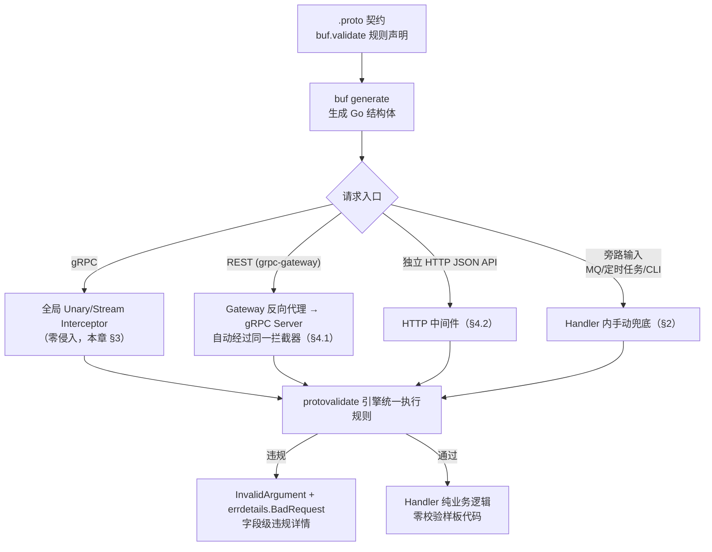

# Handler 层零手写校验与最佳实践

> 目标：**业务代码中零手写参数校验**（严禁 `if req.Username == ""` 式样板代码），校验规则 100% 由契约（`buf.validate`）声明、由 protovalidate 引擎统一执行。
> 契约：[proto/user/v1/user.proto](../proto/user/v1/user.proto) · 流程规范：[SCHEMA_FIRST_GUIDE.md](./SCHEMA_FIRST_GUIDE.md)

| 元数据 | 值 |
|---|---|
| Go 版本 | 1.26+（示例使用 `new(expr)`、`errors.AsType`、`t.Context()`、`sync.OnceValue`） |
| 校验引擎 | protovalidate Go 运行时 |
| gRPC 中间件 | go-grpc-middleware v2 |

---

## 0. 依赖与一个重要的正名

```bash
# protovalidate 官方 Go 校验引擎（运行时）
go get buf.build/go/protovalidate@latest
# gRPC 中间件（官方 protovalidate 拦截器）
go get github.com/grpc-ecosystem/go-grpc-middleware/v2@v2.3.4
# gRPC 错误详情
go get google.golang.org/genproto/googleapis/rpc
```

> **正名**：社区文档中偶见 `buf.build/go/protoevaluate` 的说法，**官方 Go 校验引擎的正确模块名是 `buf.build/go/protovalidate`**（protovalidate 运行时，本文统一使用）。两者指同一能力域：解析 `.proto` 中声明的 `buf.validate` 规则并在运行时执行。本文所有代码以官方模块名为准。

### 校验架构总览



---

## 1. 生成代码速览：`optional` 字段长什么样

执行 `buf generate` 后，`UpdateUserRequest` 中的 `optional` 标量映射为指针：

```go
// gen/go/user/v1/user.pb.go（protoc-gen-go 生成，节选）
type UpdateUserRequest struct {
    UserId    string             // 普通标量：无 presence
    Nickname  *string            // optional string → *string
    Phone     *string            // optional string → *string
    AvatarUrl *string            // optional string → *string
    Status    *UserStatus        // optional enum   → *UserStatus
    UpdateMask *fieldmaskpb.FieldMask
}

// nil 安全 Getter：字段未传递时返回零值，永不 panic
func (x *UpdateUserRequest) GetNickname() string { ... }

// 三态判定：仅 optional 字段生成 Has* 方法
func (x *UpdateUserRequest) HasNickname() bool { return x.Nickname != nil }
```

> `buf.build/go/protovalidate` 引擎读到的正是 `user.pb.go` 内嵌的规则描述符，Handler 侧无需任何规则注册。

---

## 2. 场景 A：Handler 内手动校验（兜底 + 旁路输入）

适用：MQ 消息、定时任务、CLI 参数等**不经过拦截器**的旁路输入；以及不部署全局拦截器的过渡期。

```go
package user

import (
	"context"

	"buf.build/go/protovalidate"
	"google.golang.org/grpc/codes"
	"google.golang.org/grpc/status"

	userv1 "github.com/yourorg/new-td/gen/go/user/v1"
)

// Validator 进程内单例。protovalidate.New() 会编译全部规则描述符，开销大，必须复用。
type UserServer struct {
	userv1.UnimplementedUserServiceServer
	validator protovalidate.Validator
	repo      UserRepository
}

func (s *UserServer) CreateUser(
	ctx context.Context, req *userv1.CreateUserRequest,
) (*userv1.CreateUserResponse, error) {
	// 唯一一次显式校验调用。规则来自契约，这里没有任何 if。
	if err := s.validator.Validate(req); err != nil {
		return nil, InvalidArgumentFromValidation(err)
	}

	// ↓↓↓ 纯业务逻辑：无一行参数校验样板代码 ↓↓↓
	created, err := s.repo.Create(ctx, toModel(req))
	if err != nil {
		return nil, status.Error(codes.Internal, "create user failed")
	}
	return &userv1.CreateUserResponse{User: toProto(created)}, nil
}
```

**错误映射：把 `ValidationError` 转成 gRPC 标准错误 + 字段级详情**（前端可直接高亮对应表单项）：

```go
package user

import (
	"errors"

	"buf.build/go/protovalidate"
	"google.golang.org/genproto/googleapis/rpc/errdetails"
	"google.golang.org/grpc/codes"
	"google.golang.org/grpc/status"
)

// InvalidArgumentFromValidation 将 protovalidate 的校验失败映射为
// codes.InvalidArgument + errdetails.BadRequest（字段路径 + 规则 ID + 人类可读消息）。
// 导出：gRPC 拦截器（§3）与 HTTP 中间件（§4）跨包复用同一错误映射。
func InvalidArgumentFromValidation(err error) error {
	// Go 1.26：errors.AsType 替代 errors.As + 局部变量声明
	verr, ok := errors.AsType[*protovalidate.ValidationError](err)
	if !ok {
		// 引擎自身失败（CEL 编译错误等）属服务器内部错误，不向客户端泄露细节
		return status.Error(codes.Internal, "validation engine error")
	}

	br := &errdetails.BadRequest{
		FieldViolations: make([]*errdetails.BadRequest_FieldViolation, 0, len(verr.Violations)),
	}
	for _, v := range verr.Violations {
		br.FieldViolations = append(br.FieldViolations, &errdetails.BadRequest_FieldViolation{
			Field:       v.FieldPath, // 例: "create_user.password_complexity" 所在字段路径
			Description: v.Message,   // 契约中声明的 message
		})
	}

	st := status.New(codes.InvalidArgument, "request validation failed")
	if withDetails, derr := st.WithDetails(br); derr == nil {
		return withDetails.Err()
	}
	return st.Err()
}
```

---

## 3. 场景 B：全局 gRPC Interceptor 零侵入（生产推荐）

**Handler 内连 `Validate()` 都不再出现**，校验在中间件层统一完成。

### 3.1 方式一：官方中间件（开箱即用）

```go
package main

import (
	"buf.build/go/protovalidate"
	protovalidate_middleware "github.com/grpc-ecosystem/go-grpc-middleware/v2/interceptors/protovalidate"
	"google.golang.org/grpc"
)

func main() {
	validator, err := protovalidate.New()
	if err != nil {
		panic(err)
	}

	srv := grpc.NewServer(
		grpc.ChainUnaryInterceptor(
			protovalidate_middleware.UnaryServerInterceptor(validator),
		),
		grpc.ChainStreamInterceptor(
			protovalidate_middleware.StreamServerInterceptor(validator),
		),
	)
	// ...
}
```

### 3.2 方式二：自定义拦截器（推荐，可统一错误映射与跳过策略）

```go
package middleware

import (
	"context"
	"user-svc/internal/user" // invalidArgumentFromValidation 所在包

	"buf.build/go/protovalidate"
	"google.golang.org/grpc"
	"google.golang.org/protobuf/proto"
)

// ProtovalidateUnaryInterceptor 在业务 Handler 之前执行契约校验。
// 违规 → InvalidArgument + errdetails（与场景 A 的错误映射完全一致）。
func ProtovalidateUnaryInterceptor(v protovalidate.Validator) grpc.UnaryServerInterceptor {
	return func(
		ctx context.Context, req any,
		info *grpc.UnaryServerInfo, handler grpc.UnaryHandler,
	) (any, error) {
		if msg, ok := req.(proto.Message); ok {
			if err := v.Validate(msg); err != nil {
				return nil, user.InvalidArgumentFromValidation(err)
			}
		}
		return handler(ctx, req)
	}
}

// ProtovalidateStreamInterceptor 对流式 RPC 的每一条入站消息执行校验：
// 包装 RecvMsg，使 handler 内 ss.RecvMsg() 拿到的消息都已通过契约校验。
func ProtovalidateStreamInterceptor(v protovalidate.Validator) grpc.StreamServerInterceptor {
	return func(
		srv any, ss grpc.ServerStream,
		info *grpc.StreamServerInfo, handler grpc.StreamHandler,
	) error {
		return handler(srv, &validatedServerStream{ServerStream: ss, validator: v})
	}
}

type validatedServerStream struct {
	grpc.ServerStream
	validator protovalidate.Validator
}

func (s *validatedServerStream) RecvMsg(m any) error {
	if err := s.ServerStream.RecvMsg(m); err != nil {
		return err
	}
	if msg, ok := m.(proto.Message); ok {
		if err := s.validator.Validate(msg); err != nil {
			return user.InvalidArgumentFromValidation(err)
		}
	}
	return nil
}
```

### 3.3 服务器装配与拦截器链顺序

```go
package main

import (
	"log"
	"net"

	"github.com/grpc-ecosystem/go-grpc-middleware/v2/interceptors/recovery"
	"google.golang.org/grpc"

	middleware "user-svc/internal/middleware"
	userv1 "github.com/yourorg/new-td/gen/go/user/v1"
	"user-svc/internal/user"
)

func main() {
	validator, err := protovalidate.New()
	if err != nil {
		log.Fatalf("init protovalidate: %v", err)
	}

	lis, err := net.Listen("tcp", ":9090")
	if err != nil {
		log.Fatalf("listen: %v", err)
	}

	srv := grpc.NewServer(
		grpc.ChainUnaryInterceptor(
			recovery.UnaryServerInterceptor(),                 // 1. 最外层：panic 兜底
			middleware.ProtovalidateUnaryInterceptor(validator), // 2. 契约校验（先拒绝非法流量）
			// 3. 认证 / 限流 / 日志 / tracing ...
		),
		grpc.ChainStreamInterceptor(
			middleware.ProtovalidateStreamInterceptor(validator),
		),
	)
	userv1.RegisterUserServiceServer(srv, user.NewServer(validator, user.NewUserRepo()))

	log.Println("gRPC server listening on :9090")
	if err := srv.Serve(lis); err != nil {
		log.Fatalf("serve: %v", err)
	}
}
```

> **链序原则**：recovery 最外层（兜住所有 panic）→ 校验次之（非法请求不消耗下游资源）→ 认证/鉴权 → 业务。团队如有"未认证请求不回包体错误详情"的合规要求，可将认证提到校验之前。

此后，**所有 gRPC Handler 只写业务**（对照 §6 的反模式黑名单）。

---

## 4. 场景 C：REST / HTTP 的零侵入覆盖

### 4.1 grpc-gateway 部署（默认路径，天然覆盖）

grpc-gateway 将 REST 请求**反向代理到 gRPC Server**，因此 §3 的拦截器同样覆盖 REST，HTTP 层无需任何额外校验代码：

```text
PATCH /v1/users/{id}  (JSON)
   │  grpc-gateway: protojson → proto
   ▼
gRPC Server → ProtovalidateUnaryInterceptor → Handler
```

```go
// cmd/rest/main.go（节选）
gwmux := runtime.NewServeMux()
err = userv1.RegisterUserServiceHandlerFromEndpoint(
	ctx, gwmux, grpcAddr, []grpc.DialOption{grpc.WithTransportCredentials(insecure.NewCredentials())},
)
```

### 4.2 独立 HTTP JSON API（不经 gRPC 的部署形态）

```go
package middleware

import (
	"context"
	"encoding/json"
	"errors"
	"io"
	"net/http"

	"buf.build/go/protovalidate"
	"google.golang.org/protobuf/encoding/protojson"
	"google.golang.org/protobuf/proto"
)

type ctxKey struct{}

// ProtovalidateMiddleware：解码 → 契约校验 → 将消息注入 ctx 传递给业务。
// newReq 由路由层提供，如 func() proto.Message { return &userv1.UpdateUserRequest{} }。
func ProtovalidateMiddleware(
	v protovalidate.Validator, newReq func() proto.Message,
) func(http.Handler) http.Handler {
	return func(next http.Handler) http.Handler {
		return http.HandlerFunc(func(w http.ResponseWriter, r *http.Request) {
			req := newReq()
			body, err := io.ReadAll(http.MaxBytesReader(w, r.Body, 1<<20)) // 1 MiB 上限
			if err != nil {
				http.Error(w, `{"code":"invalid_argument","message":"read body failed"}`, http.StatusBadRequest)
				return
			}

			// DiscardUnknown: true —— 前向兼容：未知字段不报错，滚动发布不炸老客户端
			if err := protojson.UnmarshalOptions{DiscardUnknown: true}.Unmarshal(body, req); err != nil {
				http.Error(w, `{"code":"invalid_argument","message":"malformed json"}`, http.StatusBadRequest)
				return
			}
			if err := v.Validate(req); err != nil {
				writeValidationErrors(w, err)
				return
			}

			next.ServeHTTP(w, r.WithContext(context.WithValue(r.Context(), ctxKey{}, req)))
		})
	}
}

// 业务侧取回已校验消息：req := r.Context().Value(middleware.CtxKey{}).(*userv1.UpdateUserRequest)
func Request[T proto.Message](ctx context.Context) (T, bool) {
	req, ok := ctx.Value(ctxKey{}).(T)
	return req, ok
}

func writeValidationErrors(w http.ResponseWriter, err error) {
	verr, ok := errors.AsType[*protovalidate.ValidationError](err)
	if !ok {
		http.Error(w, `{"code":"internal","message":"validation engine error"}`, http.StatusInternalServerError)
		return
	}
	type violation struct {
		Field   string `json:"field"`
		Message string `json:"message"`
	}
	violations := make([]violation, 0, len(verr.Violations))
	for _, v := range verr.Violations {
		violations = append(violations, violation{Field: v.FieldPath, Message: v.Message})
	}
	w.Header().Set("Content-Type", "application/json")
	w.WriteHeader(http.StatusBadRequest)
	_ = json.NewEncoder(w).Encode(map[string]any{"code": "invalid_argument", "violations": violations})
}
```

### 4.3 三态语义在 REST 侧的实测表现（`PATCH /v1/users/{id}`）

```bash
# Absent：nickname 未出现 → 服务端不修改昵称
curl -XPATCH /v1/users/6f9619ff-8b86-d011-b42d-00c04fc964ff \
  -d '{"status":"USER_STATUS_ACTIVE"}'

# Explicit Value：更新昵称
curl -XPATCH /v1/users/6f9619ff-8b86-d011-b42d-00c04fc964ff \
  -d '{"nickname":"neo"}'

# Explicit Clear：清空昵称（契约 pattern "^(|.{2,32})$" 放行空串）
curl -XPATCH /v1/users/6f9619ff-8b86-d011-b42d-00c04fc964ff \
  -d '{"nickname":""}'

# 违规：手机号非空但格式非法 → 400 + 字段级详情
curl -XPATCH /v1/users/6f9619ff-8b86-d011-b42d-00c04fc964ff \
  -d '{"phone":"123"}'
# 400 {"code":"invalid_argument","violations":[{"field":"phone","message":"value does not match regex pattern"}]}
```

---

## 5. `optional` 指针字段在业务代码中的标准处理范式

口诀：**读用 `Get*`（nil 安全），判用 `Has*`（三态），写用 `new(v)`（Go 1.26）**。

### 5.1 读取

```go
// ✅ 生成器提供的 nil 安全 Getter —— 永不 panic
log.Printf("nickname=%s", req.GetNickname())

// ✅ 三态判定必须使用 Has*
if req.HasStatus() { /* 显式设置了状态 */ }

// ❌ 禁止：零值比较伪装三态 —— GetNickname() == "" 无法区分 Absent 与 Explicit Clear
```

### 5.2 构造（Go 1.26 `new(expr)`）

```go
// Go 1.26：new() 接受表达式，直接产出指针，不再需要 tmp 变量或 proto.String
req := &userv1.UpdateUserRequest{
	UserId:   uid,
	Nickname: new("neo"), // Explicit Value
	Phone:    new(""),    // Explicit Clear
	Status:   new(userv1.UserStatus_USER_STATUS_LOCKED),
}
// Go < 1.26 的等价写法：proto.String("neo")（google.golang.org/protobuf/proto）
```

### 5.3 UpdateUser 三态合并（完整 Handler）

```go
func (s *UserServer) UpdateUser(
	ctx context.Context, req *userv1.UpdateUserRequest,
) (*userv1.UpdateUserResponse, error) {
	// 全局拦截器已校验；此处零校验代码
	current, err := s.repo.Find(ctx, req.GetUserId())
	if err != nil {
		return nil, status.Error(codes.NotFound, "user not found")
	}

	// 三态合并：nil = 不动；非 nil = 应用（含空串 = 显式清空，契约 pattern 已放行）
	if req.HasNickname() {
		current.Nickname = req.GetNickname()
	}
	if req.HasPhone() {
		current.Phone = req.GetPhone()
	}
	if req.HasAvatarUrl() {
		current.AvatarURL = req.GetAvatarUrl()
	}
	if req.HasStatus() {
		current.Status = model.UserStatus(req.GetStatus())
	}

	updated, err := s.repo.Save(ctx, current)
	if err != nil {
		return nil, status.Error(codes.Internal, "save user failed")
	}
	return &userv1.UpdateUserResponse{User: toProto(updated)}, nil
}
```

> **安全红线（`User.password_hash`）**：该字段是服务端独占字段（契约中已注明），`toProto` 资源映射时**必须显式置空**（`proto.PasswordHash = ""`），确保任何 API 响应——LoginResponse / GetUserResponse / UpdateUserResponse / ListUsersResponse 中的 User 快照——都不携带密码哈希。建议将此列为 Code Review 强制检查项。

### 5.4 通用泛型辅助（`internal/protox`）

高频操作收敛为 3 个函数，全仓统一语义：

```go
// Package protox 提供可选字段（proto3 optional → Go 指针）的统一处理原语。
package protox

// IsSet 报告可选字段是否在线上被传递（三态判定的泛型形态）。
func IsSet[T any](p *T) bool { return p != nil }

// ValueOr 解引用 p；字段缺失（p == nil）时返回 fallback。
func ValueOr[T any](p *T, fallback T) T {
	if p == nil {
		return fallback
	}
	return *p
}

// Ptr 构造指向 v 的指针（Go 1.26 前的 new(expr) 等价物；1.26 起优先直接用 new(v)）。
func Ptr[T any](v T) *T { return &v }
```

---

## 6. 禁止事项（Code Review 卡点）

```go
// ❌ 禁止：手写校验样板代码 —— 与契约脱节、不可审计、口径漂移
if req.GetUsername() == "" {
	return nil, status.Error(codes.InvalidArgument, "username is required")
}
if len(req.GetPassword()) < 8 {
	return nil, status.Error(codes.InvalidArgument, "password too short")
}

// ❌ 禁止：零值比较伪装三态
if req.GetNickname() == "" { /* Absent 与 Explicit Clear 混为一谈 */ }

// ❌ 禁止：裸解引用 optional 指针（panic 风险）
if *req.Nickname == "admin" { ... }

// ❌ 禁止：依赖标量零值做业务语义判断（零值 ≠ 未传递）
if req.Status == userv1.UserStatus_USER_STATUS_UNSPECIFIED && req.HasStatus() == false { ... }

// ❌ 禁止：为每个 Handler 重复 new validator / 每次 Validate 前重新编译规则
```

对应正确姿势：校验进契约（§0 架构图）、三态判定用 `Has*`（§5.1）、validator 进程内单例（§2）。

---

## 7. 单元测试范式

```go
package user_test

import (
	"testing"

	userv1 "github.com/yourorg/new-td/gen/go/user/v1"
	"user-svc/internal/user"
)

// 进程级单例，避免每个用例重复编译规则描述符
var testValidator = sync.OnceValue(func() protovalidate.Validator {
	v, err := protovalidate.New()
	if err != nil {
		panic(err)
	}
	return v
})

func TestUpdateUser_ThreeState(t *testing.T) {
	uid := "6f9619ff-8b86-d011-b42d-00c04fc964ff"

	tests := []struct {
		name      string
		req       *userv1.UpdateUserRequest
		wantValid bool   // 契约校验是否通过
		wantNick  string // 合并后的期望值
	}{
		{
			name:      "absent_field_is_untouched",
			req:       &userv1.UpdateUserRequest{UserId: uid},
			wantValid: true,
			wantNick:  "old-nickname",
		},
		{
			name:      "explicit_value_updates",
			req:       &userv1.UpdateUserRequest{UserId: uid, Nickname: new("new-nick")},
			wantValid: true,
			wantNick:  "new-nick",
		},
		{
			name:      "explicit_clear_empties",
			req:       &userv1.UpdateUserRequest{UserId: uid, Nickname: new("")},
			wantValid: true, // 契约 pattern 放行空串
			wantNick:  "",
		},
		{
			name:      "invalid_phone_rejected",
			req:       &userv1.UpdateUserRequest{UserId: uid, Phone: new("123")},
			wantValid: false, // 拦截器应拒绝，Handler 不被触达
		},
	}

	for _, tt := range tests {
		t.Run(tt.name, func(t *testing.T) {
			ctx := t.Context() // Go 1.24+：测试专用 context

			// 1. 引擎校验行为
			err := testValidator().Validate(tt.req)
			if got := err == nil; got != tt.wantValid {
				t.Fatalf("Validate() valid=%v, want %v, err=%v", got, tt.wantValid, err)
			}
			if !tt.wantValid {
				return
			}

			// 2. 三态合并行为（repo 用接口注入的 fake，测纯合并语义）
			repo := newFakeRepo(withUser(uid, "old-nickname"))
			srv := user.NewServerForTest(testValidator(), repo)
			if _, err := srv.UpdateUser(ctx, tt.req); err != nil {
				t.Fatalf("UpdateUser: %v", err)
			}
			if got := repo.MustGet(uid).Nickname; got != tt.wantNick {
				t.Fatalf("nickname=%q, want %q", got, tt.wantNick)
			}
		})
	}
}
```

```bash
go test -race -count=1 ./...
```

---

## 8. FAQ / 常见坑

| # | 坑 | 结论 |
|---|---|---|
| 1 | `protojson` 开启 `EmitUnpopulated: true` | 会把 `nil` 的 optional 序列化成 `""`，破坏三态。PATCH 链路禁止开启 |
| 2 | 在 `pattern` 里写 `(?=.*[a-z])` 类断言 | RE2 不支持 lookaround。复杂策略改用 message 级 CEL（见 `CreateUserRequest` 密码规则） |
| 3 | `oneof` vs `optional` | 互斥字段集合用 `oneof`；彼此独立、可单独省略的字段用 `optional`。不要为三态硬凑 `oneof` |
| 4 | `google.protobuf.StringValue` wrapper | 旧生态兼容用；新代码统一 proto3 `optional`，映射更干净 |
| 5 | 枚举"显式清空" | 枚举无空值概念，只能 Absent/设值。需"取消"语义时用业务态枚举值或独立 RPC |
| 6 | 校验放 Handler 还是拦截器 | 默认拦截器；仅旁路输入（MQ/定时任务/CLI）在入口手动 `Validate` 一次 |
| 7 | validator 复用 | `protovalidate.New()` 编译全部规则，进程内单例（含测试：`sync.OnceValue`） |
| 8 | 违规信息要不要翻译成中文 | 契约里的 `message` 就是面向调用方的文案，多语言需求在 BFF/网关层处理，引擎结果原样透传 |

---

## 9. 验收清单（本仓库自检）

- [ ] `buf lint` / `buf format --diff --exit-code` 全绿
- [ ] `buf breaking --against '.git#branch=main'` 全绿
- [ ] `buf generate` 后 `gen/` 无手改痕迹（CI drift 检查通过）
- [ ] `grep -rn "codes.InvalidArgument" --include="*_test.go" 内无手写长度/格式断言`（校验只存在于契约）
- [ ] 所有 PATCH 语义字段的规则支持 Explicit Clear（pattern 放行空串）
- [ ] 拦截器链顺序：recovery → validation → auth → business
- [ ] validator 为进程内单例（含测试）
