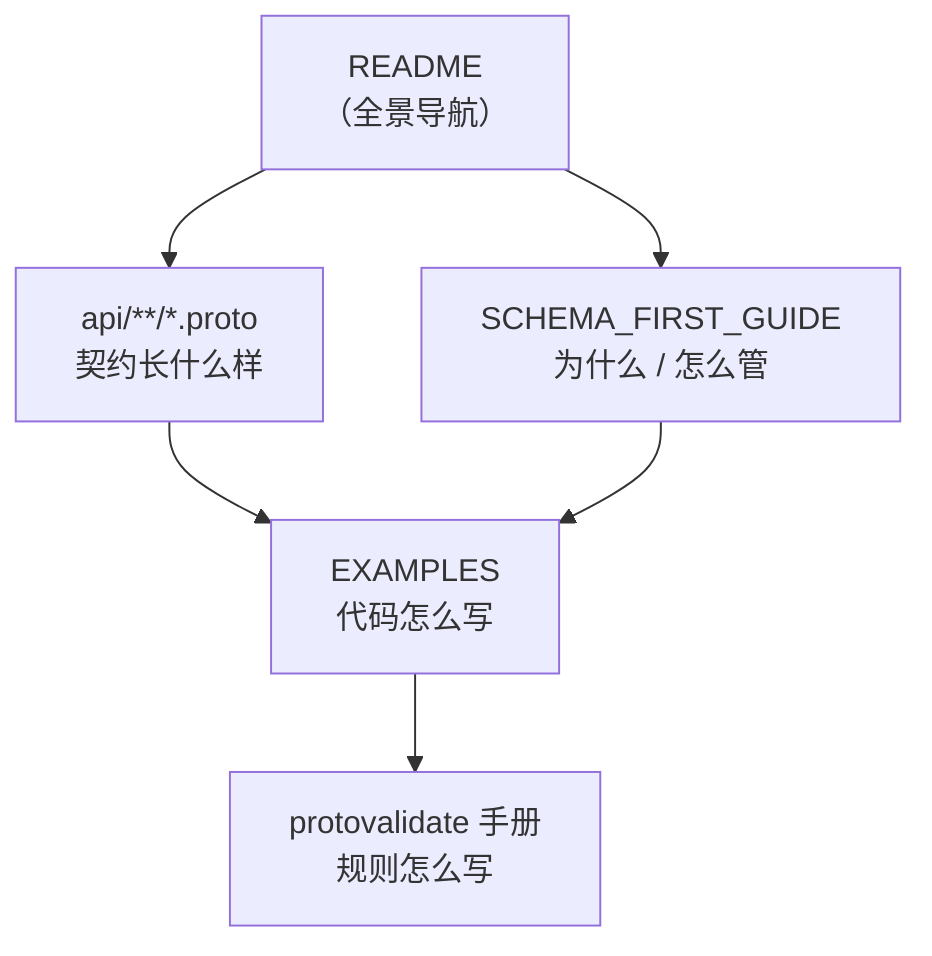

# docs — 文档导航

> 一套基于 **Protobuf + Buf 生态**的 Schema-First API 工程模板：契约即代码、校验前移到 IDL、破坏性变更机器可判、Handler 零手写校验。
> 本文档是 `docs/` 的入口，负责**导航 + 唯一的快速开始与迁移清单**。
>
> 职责划分（避免多处重复维护）：
> - 根目录 [`README.md`](../README.md)：仓库快照（完整目录树、三个服务入口、AIP 能力、命令速查）
> - 本文档：导航 + 快速开始 + 依赖清单 + 新项目迁移清单 + 版本组合
> - [`SCHEMA_FIRST_GUIDE.md`](./SCHEMA_FIRST_GUIDE.md)：契约治理规范（buf 配置、协作闭环、Zero Value Trap、CI 卡点、版本纪律）
> - [`EXAMPLES.md`](./EXAMPLES.md)：代码层范式（拦截器、三态读写、AIP 用法、测试、常见坑）

---

## 1. 文件地图

### docs 内部

| 文件 | 一句话说明 |
|---|---|
| `README.md`（本文档） | 导航 + 快速开始 + 迁移清单 |
| `SCHEMA_FIRST_GUIDE.md` | 规范主文档：协作闭环、Zero Value Trap、CI/CD 卡点、版本纪律 |
| `EXAMPLES.md` | 代码层范式：拦截器零侵入校验、`optional` 三态、AIP 用法、测试、FAQ |
| `planning/` | **规划与执行看板**（会随进度变化）：优化清单 + wire 接线方案；入口 [planning/README.md](./planning/README.md) |

> `docs/` 前三份是**规范**（该怎么做，落定后稳定）；`planning/` 是**待办与方案**（what / how，带状态标注，会持续更新）。

### 仓库关键文件

| 文件 | 位置 | 一句话说明 |
|---|---|---|
| `api/user/v1/user.proto` | `api/` | 用户域契约：8 个 RPC + `buf.validate` 全规则族 |
| `api/todo/v1/todo.proto` | `api/` | 待办域契约：CRUD + `google.api.http` 注解 |
| `internal/conf/conf.proto` | `internal/` | 启动配置契约，生成 `internal/conf/conf.pb.go` |
| `buf.yaml` | 仓库根 | Buf Workspace v2：modules `api` / `internal`、deps、lint(STANDARD)、breaking(FILE) |
| `buf.lock` | 仓库根 | 依赖锁定（`buf dep update` 产出），**必须提交** |
| `buf.gen.yaml` | 仓库根 | 生成 Go/gRPC/gateway/Swagger，输入为 `api` 目录，产出 `gen/` |
| `buf.gen.config.yaml` | 仓库根 | 生成 `internal/conf/conf.pb.go`（用 `--template` 指定） |
| `cmd/server/` | 仓库根 | 服务入口：`main.go` + wire 依赖注入（`wire.go` / `wire_gen.go`） |
| `internal/platform/` | `internal/` | 基础设施：config / database / logger / aipgorm |
| `internal/todo/`、`internal/user/` | `internal/` | 业务包（Package by Feature） |
| `db/migrations/` | 仓库根 | golang-migrate 的 SQL 迁移文件，embed 进二进制 |
| `configs/config.yaml` | 仓库根 | 运行配置（MySQL / Gin / gRPC / gateway / log） |
| `Makefile` | 仓库根 | 常用命令别名（`make help` 查看） |
| `.github/workflows/quality-gate.yml` | 仓库根 | CI 质量卡点 |

> 生成产物 `gen/`（由 `buf generate` 产出）与 `internal/conf/conf.pb.go`（由 `buf generate --template buf.gen.config.yaml` 产出）**都要提交进 git**（CI 的 drift 检查依赖它们），不要加进 `.gitignore`。

---

## 2. 阅读顺序

### 路径 A：业务开发者（约 15 分钟）

1. 根 [`README.md`](../README.md) — 全景图 + 目录树 + 三个入口
2. [`api/user/v1/user.proto`](../api/user/v1/user.proto) — 契约长什么样。重点：文件头规范注释、`User` 字段规则、`UpdateUserRequest` 的 PATCH 三态与 `update_mask` 说明
3. [`EXAMPLES.md`](./EXAMPLES.md) §2 + §4 — gRPC 拦截器装配、`optional` 指针三态读写、AIP 用法

### 路径 B：架构 / 技术负责人（1–2 小时）

1. 根 [`README.md`](../README.md)
2. [`SCHEMA_FIRST_GUIDE.md`](./SCHEMA_FIRST_GUIDE.md) 全文 — §1 原则 → §2 仓库布局 → §3 协作闭环 → §4 工程配置 → §5 零值陷阱 → §6 CI/CD → §7 版本纪律
3. [`EXAMPLES.md`](./EXAMPLES.md) 全文 — 错误映射、测试范式、常见坑
4. [protovalidate 标准规则手册](https://protovalidate.com/schemas/standard-rules/) — 写校验规则时查阅



---

## 3. 快速开始（10 分钟在本仓库跑通）

> 以下命令均在**仓库根目录**执行。已有 `go.mod`、`buf.yaml`、`buf.gen.yaml`、`api/**/*.proto`，开箱即跑。

**前置**：Go 1.26+；Buf CLI ≥ 1.72（`go install github.com/bufbuild/buf/cmd/buf@latest`）；MySQL 可用（默认 `root:123456@localhost:3306/todo_db`，见 `configs/config.yaml`）；IDE 建议装 Buf 插件（`bufbuild.vscode-buf`）。

```bash
# 0) 确认工具链
buf --version && go version

# 1) 解析 BSR 依赖，产出/更新 buf.lock（首次必做）
buf dep update

# 2) 契约质量检查（应全绿、无输出）
buf lint
buf format --exit-code      # 可选：需 diff 命令（Linux/macOS/Git Bash）；Windows cmd 无 diff.exe 可跳过，CI 仍会跑

# 3) 生成代码
buf generate                                   # → gen/go/**、gen/openapi/openapi.swagger.yaml
buf generate --template buf.gen.config.yaml    # → internal/conf/conf.pb.go

# 4) 拉取 Go 依赖（go.mod 已存在，无需 go mod init）
go mod download
go build ./...

# 5) 启动服务（自动建库 + 执行迁移）
go run ./cmd/server -conf configs/config.yaml
```

等价的 `make` 别名：`make deps`、`make proto-lint`、`make gen`、`make build`、`make run`；`make help` 查看全部。

**验证成功的标志**：

| 检查项 | 期望 |
|---|---|
| `buf lint` | 退出码 0，无输出 |
| `gen/go/user/v1/` | 出现 `user.pb.go`、`user_grpc.pb.go`、`user.pb.gw.go` |
| `gen/go/todo/v1/` | 出现 `todo.pb.go`、`todo_grpc.pb.go`、`todo.pb.gw.go` |
| `gen/openapi/` | 出现 `openapi.swagger.yaml`（**Swagger 2.0**，由 openapiv2 插件 `allow_merge` 合并成的单文件） |
| `internal/conf/` | 出现 `conf.pb.go` |
| `go run ./cmd/server` | 三端口监听：Gin `:8080`、gRPC `:9090`、gateway `:8081` |

---

## 4. 日常研发流程

六阶段闭环（详见 [SCHEMA_FIRST_GUIDE.md §3](./SCHEMA_FIRST_GUIDE.md)）：

| 阶段 | 动作 | 命令 / 产物 |
|---|---|---|
| ① API 设计 | 发起**只含 `.proto` 变更**的 MR，校验规则写进契约 | `api/**/*.proto` |
| ② 本地自检 | 提交前跑检查（见根 README 命令速查） | `make check` |
| ③ MR 卡点 | CI 执行 lint + format + breaking + drift | `.github/workflows/quality-gate.yml` |
| ④ 代码生成 | 合入 main 后产出产物 | `make gen` |
| ⑤ 业务实现 | 只写业务逻辑，零手写校验 | 按 [EXAMPLES.md](./EXAMPLES.md) |
| ⑥ 联调 / 分发 | REST 走 grpc-gateway（已注解） | `buf curl` |

> 命令速查统一维护在根 [`README.md`](../README.md#日常命令速查)，此处不再复制。

---

## 5. 如何在新项目中复用（迁移清单）

### 第 1 步：复制文件

```text
新仓库/
├── buf.yaml                    ← 原样复制（仓库根）
├── buf.gen.yaml                ← 原样复制（插件版本勿改）
├── buf.gen.config.yaml         ← 按需复制（若也需要 proto 配置契约）
├── api/
│   └── <domain>/v1/*.proto     ← 作为契约模板改造
├── internal/
│   └── conf/conf.proto         ← 按需复制（配置契约）
├── cmd/server/                 ← 服务入口 + wire
├── internal/platform/          ← 基础设施
├── db/migrations/              ← 迁移文件（改为你的表）
├── configs/config.yaml         ← 运行配置
├── Makefile
└── docs/                       ← 按需保留
```

### 第 2 步：替换占位符（全局搜索替换）

| 占位符 | 出现位置 | 替换为 |
|---|---|---|
| `go-buf-api-template` | 各 `.proto` 的 `go_package`、Go import | 你的 module 名（**本仓库已用此名，无需再改**） |
| `com.example.gobuf.*` | `api/user/v1/user.proto` 的 `java_package` | 你的 Java 包名（或删除 `java_*` 选项） |
| `;userv1` / `;todov1` | `go_package` 末尾别名 | 按域改名，如 `;orderv1` |
| `root:123456@tcp(localhost:3306)/todo_db` | `configs/config.yaml` | 你的 MySQL DSN（**保留 `loc=UTC`**） |

**新增业务域的目录约定**（buf lint 强制 package 与目录一致）：

| 说明 | 目录 | package |
|---|---|---|
| 通用约定 | `api/<domain>/<version>/` | `<domain>.<version>` |
| 现有用户域 | `api/user/v1/` | `user.v1` |
| 现有待办域 | `api/todo/v1/` | `todo.v1` |
| 示例：新增订单域 | `api/order/v1/order.proto` | `order.v1` |

> `internal` module 在 `buf.yaml` 中已 `except` 掉 `PACKAGE_DIRECTORY_MATCH` 与 `PACKAGE_VERSION_SUFFIX`，因此 `internal/conf/conf.proto` 不必带版本后缀。

### 第 3 步：初始化 Go 模块

```bash
go mod init <你的模块名>
buf dep update && buf lint && buf generate
buf generate --template buf.gen.config.yaml   # 若有配置契约
go mod tidy && go build ./...
```

### 第 4 步：接入 CI 质量卡点

1. 参考 [SCHEMA_FIRST_GUIDE.md §6](./SCHEMA_FIRST_GUIDE.md) 的 workflow / GitLab CI **模板**（本仓库已落地 `.github/workflows/quality-gate.yml`）。
2. 分支保护：将质量卡点 job 设为 **Required status check**。
3. CODEOWNERS（可选）：对 `api/`、`gen/`、`db/migrations/` 强制架构组评审。

> 本仓库目前**未配置 CODEOWNERS**；GUIDE 中的片段为示例模板。

### 迁移检查清单

- [ ] `buf.yaml` / `buf.gen.yaml`（及 `buf.gen.config.yaml`）已复制，插件版本号未被改动
- [ ] `buf dep update` 成功，`buf.lock` 已提交
- [ ] `buf lint` 全绿
- [ ] `buf generate` 产出 `gen/`；`--template buf.gen.config.yaml` 产出 `internal/conf/conf.pb.go`
- [ ] 占位符已全部替换（`grep -rn "com.example.gobuf"` 应为空）
- [ ] `go build ./...` 通过
- [ ] CI workflow 已合入，required check 生效
- [ ] `gen/` 与 `internal/conf/conf.pb.go` 已提交进版本控制（未进 `.gitignore`）

---

## 6. FAQ（常见报错速查）

| 现象 | 原因与解决 |
|---|---|
| IDE 大量 `imported file does not exist` / `cannot find buf.validate.field` | `buf.lock` 缺失或过期 → 跑 `buf dep update`；确认已装 Buf 插件 |
| `buf generate` 报 `plugin references must be specified as "<name>:<version>"` | remote 插件必须固定版本号（`buf.gen.yaml` 已固定，勿删） |
| 正则报 `invalid repeat count` | RE2 重复计数上限 1000（`{1,2048}` 非法）→ 长度限制交给 `string.max_len` |
| 密码复杂度写不进 `pattern` | RE2 不支持 lookaround → 用 message 级 CEL 规则（`api/user/v1/user.proto` 的 `CreateUserRequest` 有示例） |
| `buf format --exit-code` 在 Windows 报 `exec: "diff": executable file not found` | buf 的格式检查内部依赖外部 `diff` 命令。Windows cmd 下可跳过该步（CI/Linux 会跑），或改用 Git Bash / 把 Git 的 `usr\bin` 加入 PATH。`make check` 已不含此步，单独跑 `make proto-format` 才需要 |
| 过滤表达式报 `no matching overload` | 枚举字段须按字符串写（`status = "DONE"`，不是 `status = 3`）；字段必须在服务的 `aipgorm.Schema` 中声明 |
| 服务起来了但表里没数据 / 没建表 | 检查 `schema_migrations` 的 version：若大于本项目最新迁移号，golang-migrate 会判定"已最新"而跳过 |
| 更多坑（protojson 三态、oneof vs optional、validator 单例等） | [EXAMPLES.md §7](./EXAMPLES.md) |

---

## 7. 已验证的版本组合

### 工具链

| 组件 | 版本 | 说明 |
|---|---|---|
| Go | 1.26.2 | `go.mod` 声明 |
| Buf CLI | 1.72.0+（实测 1.73.0） | `buf lint` / `buf build` / `buf generate` 全绿 |
| protoc-gen-go（remote plugin） | v1.36.12 | 生成 `*.pb.go`，optional → 指针 |
| protoc-gen-go-grpc（remote plugin） | v1.6.2 | 生成 `*_grpc.pb.go` |
| grpc-gateway（remote plugin） | v2.30.0 | 生成 `*.pb.gw.go` |
| openapiv2（remote plugin） | v2.30.0 | 生成 `gen/openapi/openapi.swagger.yaml`（Swagger 2.0，合并单文件） |

### 运行时依赖（均为 `go.mod` 直接依赖）

| 依赖 | 版本 | 用途 |
|---|---|---|
| `github.com/gin-gonic/gin` | v1.12.0 | HTTP 引擎 |
| `gorm.io/gorm` + `gorm.io/driver/mysql` | v1.31.2 / v1.6.0 | ORM 与 MySQL 驱动 |
| `github.com/golang-migrate/migrate/v4` | v4.20.1 | SQL 迁移 |
| `github.com/google/wire` | v0.7.0 | 依赖注入代码生成 |
| `go.einride.tech/aip` | v0.86.3 | AIP-158/160/132/134 能力 |
| `buf.build/go/protovalidate` | v1.4.0 | 契约校验引擎 |
| `github.com/grpc-ecosystem/go-grpc-middleware/v2` | v2.3.4 | protovalidate / recovery 拦截器 |
| `github.com/grpc-ecosystem/grpc-gateway/v2` | v2.30.0 | REST 网关运行时 |
| `google.golang.org/grpc` / `protobuf` | v1.84.0 / v1.36.12 | gRPC 与 Protobuf 运行时 |
| `go.uber.org/automaxprocs` | v1.6.0 | 按 CPU quota 设置 GOMAXPROCS |
| `github.com/google/uuid` | v1.6.0 | 生成 UUID |
| `golang.org/x/crypto` | v0.57.0 | bcrypt 加验密 |
| `sigs.k8s.io/yaml` | v1.6.0 | YAML → JSON（配置解析，不用 Viper） |
| `github.com/go-sql-driver/mysql` | v1.8.1 | 直接驱动（迁移建库、唯一键错误识别） |
