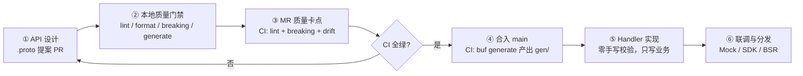

# Schema-First / IDL-First 研发流程与工程规范

> 适用范围：本仓库全部 RPC / REST API 契约。
> 契约目录：`proto/<domain>/<version>/*.proto`（Buf Module 根 = `proto/`，规范文档在 `docs/`）。
> 配套文档：[EXAMPLES.md](./EXAMPLES.md)（Handler 层实现范式） · [契约 Demo：proto/user/v1/user.proto](../proto/user/v1/user.proto)。

| 元数据 | 值 |
|---|---|
| 文档版本 | v1.0.0 |
| 目标语言 | Go 1.26+ |
| 工具链 | Buf CLI（config v2）/ protoc-gen-go / gRPC-Go / grpc-gateway v2 |
| 校验引擎 | protovalidate（官方 Go 运行时：`buf.build/go/protovalidate`） |

---

## 1. 核心原则：为什么是 Schema-First

1. **契约即代码（Contract as Code）**：`.proto` 文件是前后端、服务间交互的**唯一事实来源（SSOT）**。所有请求/响应结构、错误语义、校验规则均以 IDL 为准，禁止在文档、IM、口头上另立契约。
2. **校验前移到契约**：参数约束（长度、格式、范围、必填）声明在 `.proto` 中，由 protovalidate 引擎在运行时统一执行。**业务代码中严禁出现手写参数校验样板代码**（详见 [EXAMPLES.md §6](./EXAMPLES.md)）。
3. **破坏性变更机器可判**：兼容性不靠人肉 Review，由 `buf breaking` 在 MR 阶段机器判定并阻断。
4. **生成而非手写**：Go 结构体、gRPC Stub、REST Gateway、OpenAPI 描述全部由 `buf generate` 产出，人工禁止修改 `gen/` 目录。
5. **字段语义显式化**：所有"可更新/可空/三态"字段必须使用 `optional` 声明（见 §5 Zero Value Trap），禁止依赖标量零值做语义判断。

**反模式黑名单**：

| 反模式 | 后果 | 替代方案 |
|---|---|---|
| 先写代码，后补文档/契约 | 契约与实现漂移 | 契约提案 PR 先行 |
| 在 Handler 中手写 `if x == ""` 校验 | 校验规则分散、不可审计 | `buf.validate` + 拦截器 |
| 用标量零值表达"未传/清空" | 三态坍缩，PATCH 语义丢失 | `optional` 指针（§5） |
| 手动改 `gen/` 生成代码 | 下次 generate 被覆盖 | 修改 `.proto` 重新生成 |
| 复用已删除字段的编号 | 读写串线，线上事故 | `reserved`（§7） |

---

## 2. 仓库布局

```text
.
├── buf.yaml                      # Buf Workspace（Module 根 = proto/），lint/breaking 规则
├── buf.gen.yaml                  # 代码生成配置（remote plugins，可复现构建）
├── buf.lock                      # 依赖锁定（buf dep update 产出，必须提交）
├── gen/                          # 生成产物（禁止手改；CI drift 检查覆盖）
│   ├── go/
│   │   └── user/
│   │       └── v1/
│   │           ├── user.pb.go
│   │           ├── user_grpc.pb.go
│   │           └── user.pb.gw.go
│   └── openapi/
│       └── user/
│           └── v1/
│               └── user.openapi.json
├── proto/                        # ← Buf Module 根（API 契约的家）
│   └── user/
│       └── v1/
│           └── user.proto        # 契约文件（package user.v1 必须与目录一致）
└── docs/                         # 规范与导航文档（Markdown）
    ├── README.md                 # 导航入口：阅读顺序 / 使用步骤 / 新项目迁移指南
    ├── SCHEMA_FIRST_GUIDE.md     # 本文档
    └── EXAMPLES.md               # Handler 层最佳实践
```

> **目录与包名强约束**：buf lint 规则 `PACKAGE_DIRECTORY_MATCH` 要求 package 路径与文件目录严格一致，即 `package user.v1` 只能放在 `proto/user/v1/` 下。

---

## 3. 协作闭环：从 API 设计到 Handler 落地



### 3.1 阶段一：API 设计（提案 PR 只含 `.proto`）

- 新接口以 **只包含 `.proto` 变更的 MR** 发起（可附时序图/字段说明），后端、前端、调用方在同一份契约上评审。
- 设计必须遵守：
  - 命名规范由 buf lint `STANDARD` 规则集自动强制（`SERVICE_SUFFIX`、`RPC_REQUEST_STANDARD_NAME`、`ENUM_VALUE_PREFIX` 等，速查见 §9.2）。
  - **同 package 新增第二个 `.proto` 文件时**，`go_package` / `java_package` / `java_multiple_files` / `csharp_namespace` 等 file options 必须与既有文件**逐字节一致**（lint `PACKAGE_SAME_*` 强制）；最稳妥做法是整体复制既有文件的 option 块。
  - 所有入参字段挂 `buf.validate` 校验规则；规则设计原则见 §5.3。
  - 涉及"部分更新"的请求，字段语义按 §5.3 PATCH 三态模型设计。

### 3.2 阶段二：本地质量门禁

提交前在本地执行（建议配置为 pre-commit / Makefile 别名）：

```bash
buf dep update                              # 解析/更新依赖，产出 buf.lock
buf lint                                    # 风格与结构规范（STANDARD 规则集）
buf format --diff --exit-code               # 格式检查（CI 同款，保证 diff 干净）
buf breaking --against '.git#branch=main'   # 兼容性检查（对 main 的 merge-base）
buf generate                                # 生成 Go 代码并本地编译验证
```

### 3.3 阶段三：MR 质量卡点（自动化）

MR 中由 CI 重新执行 lint / format / breaking / drift 四项检查并**阻断合并**（详见 §6）。

### 3.4 阶段四：代码生成

合入后 CI 执行 `buf generate` 产出 `gen/`。配置使用 **Buf Remote Plugins**（见 §4.2），保证全团队与 CI 的生成结果逐字节一致。

### 3.5 阶段五：Handler 实现

- Handler（gRPC Server / Usecase）**只写业务逻辑**；参数校验已由契约声明 + 全局拦截器完成。
- `optional` 字段按 [EXAMPLES.md §5](./EXAMPLES.md) 的指针范式处理。
- 需要新增/修改校验规则时，回到阶段一修改 `.proto`，而非在 Go 代码里加 if。

### 3.6 阶段六：联调与分发

| 产物 | 生成方式 | 消费方 |
|---|---|---|
| Go Stub | `buf generate` | 本仓库服务端/客户端 |
| OpenAPI v3 | `buf generate`（`buf.build/grpc-ecosystem/openapiv3` 插件，已配置） | 前端、外部 API 文档 |
| Mock Server | `grpcmobile`/`buf build` + 任意 gRPC mock 工具，或 BSR `buf curl` | 前端并行开发 |
| 多语言 SDK | Buf Schema Registry（BSR）托管 Module | 跨团队调用方 |

---

## 4. 工程配置基准

### 4.1 `buf.yaml`（仓库根）

```yaml
# Buf Workspace：Module 根为 proto/（API 契约），规范文档在 docs/。
version: v2
modules:
  - path: proto
deps:
  - buf.build/bufbuild/protovalidate   # buf/validate/validate.proto
  - buf.build/googleapis/googleapis    # google/api/annotations.proto 等
lint:
  use:
    - STANDARD                         # 官方标准规则集（含命名/目录/版本约束）
breaking:
  use:
    - FILE                             # 以"文件"粒度判定破坏性变更（含跨文件引用分析）
```

### 4.2 `buf.gen.yaml`（仓库根）

```yaml
# 远程插件：版本由 BSR 锁定，本地与 CI 无需安装 protoc / Go 插件，结果可复现。
# 注意：remote 插件引用必须显式固定版本号（<name>:<version>），未固定版本会被 buf 拒绝。
version: v2
clean: true                              # 每次生成前清理 out 目录，杜绝陈旧产物
plugins:
  # Proto 消息 → Go 结构体（optional 标量 → 指针字段）
  - remote: buf.build/protocolbuffers/go:v1.36.12
    out: gen/go
    opt: paths=source_relative
  # gRPC Service Stub
  - remote: buf.build/grpc/go:v1.6.2
    out: gen/go
    opt: paths=source_relative
  # REST Gateway（依赖 google.api.http 注解）
  - remote: buf.build/grpc-ecosystem/gateway:v2.30.0
    out: gen/go
    opt:
      - paths=source_relative
      - generate_unbound_methods=false
  # OpenAPI v3——前端/网关契约交付物
  - remote: buf.build/grpc-ecosystem/openapiv3:v2.30.0
    out: gen/openapi
```

> ① 为什么不启用 `managed` 模式：本仓库在各 `.proto` 中**显式声明** `option go_package = "...;userv1";`，通过别名精确控制 Go 包名，而不依赖 protoc-gen-go 从导入路径自动推导（推导规则会随目录结构变化，不可控）。显式声明 + 关闭 managed 模式是最可预测的组合。
> ② 以上配置已在本仓库实测通过：`buf lint` 全绿，`buf generate` 可产出 `user.pb.go` / `user_grpc.pb.go` / `user.pb.gw.go` / `openapi/user/v1/user.openapi.json`（OpenAPI v3）。

### 4.3 `Makefile`

```makefile
BUF ?= buf

.PHONY: proto-update proto-lint proto-format proto-breaking proto-generate proto-check

proto-update:      ## 解析/更新 BSR 依赖并锁定 buf.lock
	$(BUF) dep update

proto-lint:        ## 契约风格与结构检查
	$(BUF) lint

proto-format:      ## 格式检查（不自动改写，与 CI 行为一致）
	$(BUF) format --diff --exit-code

proto-breaking:    ## 对 main 的兼容性检查
	$(BUF) breaking --against '.git#branch=main'

proto-generate:    ## 生成 Go 代码
	$(BUF) generate

proto-check: proto-update proto-format proto-lint proto-breaking proto-generate  ## 提交前全量自检
```

### 4.4 首次初始化 SOP

```bash
# 1. 确认 buf.yaml / buf.gen.yaml 已就位
# 2. 解析依赖，生成 buf.lock（必须提交到仓库）
buf dep update
# 3. 首次生成
buf generate
# 4. 将 go.mod 中 gen 包纳入模块
go mod edit -require=github.com/yourorg/new-td@v0.0.0   # 按实际 module 路径调整
# 5. 全量自检
make proto-check
```

> **请全局替换占位模块路径** `github.com/yourorg/new-td` 为实际仓库地址（`buf.gen.yaml` 无需改动，`user.proto` 的 `go_package` 与示例代码 import 需同步）。

---

## 5. 字段与零值陷阱规范（Zero Value Trap）

### 5.1 问题本质：proto3 标量零值会让"三态"坍缩成"两态"

proto3 中**未声明 `optional` 的标量字段没有 presence（存在性）语义**：`""`、`0`、`false` 既可能是"调用方没传"，也可能是"调用方明确传了零值"。落到 Go 就是同一个值，**PATCH 语义无法表达**：

```text
wire 上 {"nickname": ""}        →  Go: Nickname = ""      ─┐
wire 上 {}（字段缺失）          →  Go: Nickname = ""      ─┴─ 两种意图不可区分 ❌
```

典型事故：用户只想"更新头像"，后端把没传的 `phone: ""` 理解为"清空手机号"，数据被静默抹掉。

### 5.2 规范一：可三态字段必须使用 `optional`，映射为 Go 指针

在 proto3 中为标量加 `optional` 关键字（Open Edition 语法，字段编号不变，**对读取方完全兼容**），protoc-gen-go 将其映射为指针类型，恢复三态能力：

| Protobuf 声明 | Go 生成字段 | 语义 |
|---|---|---|
| `string nickname = 1;` | `Nickname string` | 无 presence：三态坍缩 ❌ |
| `optional string nickname = 1;` | `Nickname *string` | `nil` / 指向 `""` / 指向有效值，三态完备 ✅ |
| `optional int32 age = 2;` | `Age *int32` | 同上 |
| `optional UserStatus status = 3;` | `Status *UserStatus` | 枚举同样适用 |
| `google.protobuf.Timestamp updated_at` | `*timestamppb.Timestamp` | message 引用类型天然 nullable |
| `repeated string tags` | `Tags []string` | `nil` 与 `[]` 可区分（一般无需 optional） |

**生成的访问器（protoc-gen-go）**：

| 生成 API | 普通标量 | `optional` 标量 |
|---|---|---|
| 结构体字段 | `Name string` | `Name *string` |
| `GetName() string` | ✅ nil 不适用 | ✅ nil 安全，返回 `""` |
| `HasName() bool` | ❌ 不生成 | ✅ 仅 `optional` 字段生成，三态判定唯一手段 |

**protojson 线上行为**（REST / HTTP 调试必须理解）：

| 请求 JSON | 反序列化到 Go | 三态语义 |
|---|---|---|
| `{"nickname": "neo"}` | `Nickname = new("neo")` | Explicit Value（更新） |
| `{"nickname": ""}` | `Nickname = new("")` | Explicit Clear（显式清空） |
| `{}`（不含该键） | `Nickname = nil` | Absent（保持不变） |

> ⚠️ `protojson.MarshalOptions{EmitUnpopulated: true}` 会把 `nil` 的 optional 字段序列化成 `""`，**会破坏三态**。PATCH 类响应/日志禁止开启；仅在全量导出场景使用。

### 5.3 规范二：PATCH 部分更新的三态契约

`UpdateUserRequest` 类接口的字段语义定义如下（服务端实现范式见 [EXAMPLES.md §5](./EXAMPLES.md)）：

| 状态 | 请求表现 | Go 判定 | 服务端行为 |
|---|---|---|---|
| **Absent**（未传递） | JSON 无该键 / gRPC 字段未设置 | `req.Nickname == nil` / `!req.HasNickname()` | 保持原值，不修改 |
| **Explicit Value**（传有效值） | 传递合法值 | `req.HasNickname() && *req.Nickname != ""` | 更新为该值 |
| **Explicit Clear**（显式清空） | 传递零值（字符串 `""`） | `req.HasNickname() && *req.Nickname == ""` | 清空该字段 |

**契约层三条铁律**：

1. **支持"显式清空"的 `optional` 字段，禁止使用 `min_len`、`email` 等会拒绝空串的规则**；必须改用"允许空串"的 `pattern`（空分支 + 正常分支）。否则 Explicit Clear 永远过不了校验：

   ```protobuf
   // ❌ 错误：空串（显式清空）会被 min_len 拒绝，三态残废
   optional string phone = 3 [(buf.validate.field).string.min_len = 8];

   // ✅ 正确：pattern 放行空串，非空时校验手机号格式
   optional string phone = 3 [(buf.validate.field).string.pattern = "^(|1[3-9][0-9]{9})$"];
   ```

2. **业务代码判定三态必须使用 `Has*()`，禁止零值比较**（`Get*() == ""` 无法区分 Absent 与 Explicit Clear）。
3. **枚举与 message 字段不适用 Explicit Clear**（枚举无法表达"空"，message 引用类型另有 presence 语义）。需要"取消/清空"语义时，三选一：
   - 为该字段单独提供操作（如 `UnassignRole` 类 RPC）；
   - 引入显式业务态枚举值（如 `USER_STATUS_CANCELLED`）；
   - 启用方案 B：FieldMask（见 5.5）。

### 5.4 规范三：Go 侧处理范式（摘要）

完整代码见 [EXAMPLES.md](./EXAMPLES.md)。核心口诀：**读用 `Get*`（nil 安全），判用 `Has*`（三态），写用 `new(v)`（Go 1.26 表达式构造指针）**。

```go
// Go 1.26：new() 支持表达式，直接构造指针
req := &userv1.UpdateUserRequest{
    UserId:   id,
    Nickname: new("neo"),   // Explicit Value
    Phone:    new(""),      // Explicit Clear
}
```

### 5.5 方案 B：FieldMask 白名单更新（AIP-134）

当"可更新字段集合"需要**动态控制**（多端权限差异、批量接口）时，在请求中追加 `optional google.protobuf.FieldMask update_mask`：

- 语义切换为：mask 中**声明了路径的字段才被更新**；optional 字段只承担两态（present = 更新，absent = 不动）。
- "显式清空"由 mask 路径 + 零值组合表达，服务端按路径逐项应用。
- 服务端**必须校验 mask 路径白名单**，拒绝未声明的路径，防止越权字段写入。

两种方案选型：

| 维度 | 方案 A：optional 三态 | 方案 B：FieldMask |
|---|---|---|
| 表达力 | 每字段独立三态 | 动态路径白名单 |
| 实现复杂度 | 低（指针判空） | 中（路径校验、mask 规范化） |
| 适用场景 | 常规资源 PATCH | 多端权限差异、批量/代理更新 |
| 本仓库默认 | ✅ 优先 | 按需启用，二者不混用于同一字段 |

---

## 6. CI/CD 质量卡点

### 6.1 卡点矩阵

| 卡点 | 工具 | 触发时机 | 失败动作 |
|---|---|---|---|
| 契约风格/结构 | `buf lint` | MR + push | ❌ 阻断合并 |
| 兼容性 | `buf breaking` | MR（对 merge-base） | ❌ 阻断合并 |
| 格式一致性 | `buf format --diff --exit-code` | MR | ❌ 阻断合并 |
| 依赖锁定漂移 | `buf dep update` + git diff | MR | ❌ 阻断合并 |
| 生成代码漂移 | `buf generate` + git diff | MR | ❌ 阻断合并 |
| 契约评审 | CODEOWNERS | 契约路径变更 | 要求架构组 Approve |

### 6.2 GitHub Actions（`.github/workflows/proto-quality-gate.yml`）

```yaml
name: proto-quality-gate

on:
  pull_request:
    paths:
      - "docs/**/*.proto"
      - "buf.yaml"
      - "buf.gen.yaml"
      - ".github/workflows/proto-quality-gate.yml"

permissions:
  contents: read

jobs:
  buf:
    runs-on: ubuntu-latest
    steps:
      - uses: actions/checkout@v4
        with:
          fetch-depth: 0              # merge-base 对比需要完整提交历史

      - uses: bufbuild/buf-setup-action@v1
        with:
          github_token: ${{ secrets.GITHUB_TOKEN }}

      - name: Lint
        run: buf lint

      - name: Format check
        run: buf format --diff --exit-code

      - name: Breaking change check (vs merge-base)
        run: buf breaking --against '.git#commit=${{ github.event.pull_request.base.sha }}'

      - name: Dependency lock drift check
        run: |
          buf dep update
          git diff --exit-code -- buf.lock \
            || (echo "::error::buf.lock 已过期，请执行 buf dep update 并提交" && exit 1)

      - name: Generated code drift check
        run: |
          buf generate
          git diff --exit-code -- gen \
            || (echo "::error::生成代码与 .proto 不同步，请执行 buf generate 并提交" && exit 1)
```

> Remote plugins 仅需网络即可下载，CI 镜像无需预装 Go 工具链。

### 6.3 GitLab CI（`.gitlab-ci.yml` 片段）

```yaml
proto-quality-gate:
  stage: verify
  image: bufbuild/buf:latest
  variables:
    GIT_DEPTH: 0                        # merge-base 对比需要完整提交历史
  rules:
    - if: '$CI_PIPELINE_SOURCE == "merge_request_event"'
      changes:
        - "docs/**/*.proto"
        - "buf.yaml"
        - "buf.gen.yaml"
  script:
    - buf lint
    - buf format --diff --exit-code
    - buf breaking --against ".git#commit=${CI_MERGE_REQUEST_DIFF_BASE_SHA}"
    - buf generate && git diff --exit-code -- gen
```

### 6.4 分支保护与 MR 策略

| 配置 | 位置 | 效果 |
|---|---|---|
| Required status check：`buf` | GitHub → Settings → Branches → Protection | lint/breaking 未过，禁止合并 |
| Pipelines must succeed | GitLab → Settings → Merge requests | 同上 |
| CODEOWNERS 强制评审 | 仓库 CODEOWNERS | 契约变更必须架构组 Approve |
| `gen/` 目录禁手改 | CODEOWNERS + drift 检查 | 生成代码仅允许机器人/CI 提交 |

```text
# CODEOWNERS（GitHub: .github/CODEOWNERS / GitLab: CODEOWNERS）
/docs/    @org/backend-architecture
/gen/     @org/backend-architecture
```

---

## 7. 版本演进与兼容性纪律

### 7.1 变更兼容性对照表

| 变更 | 兼容性 | 约束 |
|---|---|---|
| 新增字段（新编号） | ✅ 非破坏 | 必须使用全新编号，不得复用已删除编号 |
| 新增 `optional` 字段 | ✅ 非破坏 | 读取方必须容忍字段缺失 |
| 新增 RPC | ✅ 非破坏 | — |
| 新增枚举值 | ✅（`FILE` 模式下放行） | 服务端必须能处理未知枚举值 |
| 修改字段编号 / 类型 | ❌ 破坏 | `buf breaking` 拦截；禁止 |
| 删除 / 改名字段、RPC | ❌ 破坏 | 走 §7.3 下线流程 |
| 删除 / 复用枚举编号 | ❌ 破坏 | 先 `reserved` |

### 7.2 字段下线：`deprecated` + `reserved` 两步走

```protobuf
message User {
  // 第一步：标记废弃（非破坏，生成代码产生告警注释）
  string fax = 9 [deprecated = true];

  // 第二步：所有调用方迁移完成后，物理删除字段并锁死编号与名字（破坏性，
  // 必须在下一个版本窗口执行，删除前先确认 buf breaking 报告）
  reserved 9;
  reserved "fax";
}
```

### 7.3 不可兼容变更 SOP（v2 并行）

1. 新建 `proto/user/v2/`，package `user.v2`，v1 保持冻结。
2. v1 中被替代的 RPC 打上 `deprecated = true`，响应头/文档标注迁移窗口。
3. 调用方迁移至 v2，观测 v1 流量归零。
4. 在约定的版本窗口内删除 v1（`buf breaking` 对 v1 目录的删除告警需架构组显式豁免记录）。

---

## 8. 与公司遗留 proto 体系（sdmsx）的差异对照

公司内并存两套契约风格：本规范管理的 Schema-First 体系（`docs/`），与 protoc + git submodule + 后处理脚本驱动的遗留体系（`bsi-proto/sdmsx` 组织仓库，其切片曾暂存于本仓库 `proto/` 目录，现已移除）。**遗留体系不纳入本仓库 buf 工具链**（接入将触发 STANDARD 规则全量报错）。差异对照如下，供团队理解两类风格并做渐进迁移：

| 维度 | 本规范（docs/） | 遗留体系（bsi-proto/sdmsx） | 说明 |
|---|---|---|---|
| 字段命名 | lower_snake_case（proto 社区标准） | PascalCase + Python 脚本后处理转换 | snake_case 生成 Go/JSON 更符合惯例，无需后处理脚本 |
| 枚举 | proto enum + `defined_only` 校验 | `int32` + 注释魔数（如 IsEnable 1/2） | 枚举自文档、可校验、可演进 |
| 可空/三态 | proto3 `optional` → Go 指针 | `google.protobuf.wrappers.*` | optional 映射更干净，且统一 PATCH 三态语义 |
| 响应消息 | 每个 RPC 独立 Request/Response | 通用 `OperationResponse` 复用 | buf lint `RPC_REQUEST_RESPONSE_UNIQUE` 禁止复用；独立消息可承载各自字段与校验 |
| service 命名 | `XxxService` + 资源化 RPC（AIP 风格） | `XxxManager` + 动词后置（`UserAdd`） | buf lint `SERVICE_SUFFIX` 等自动强制 |
| 版本化 | package 以 `vN` 结尾 + `buf breaking` 机器卡点 | package 无版本 | 遗留体系兼容性靠约定，无工具保障 |
| 工具链 | buf lint/format/breaking/generate + remote plugins | protoc + git submodule + Python/PowerShell 后处理 | 前者声明式、可复现、CI 可卡点 |
| 契约交付物 | `buf generate` 产出 OpenAPI v3（`gen/openapi/`） | protoc openapiv2 插件产出 swagger.json + http-server 发布 | 同一目标，前者纳入同一套 generate 流水线 |
| 参数校验 | `buf.validate` 契约级规则 + 引擎统一执行 | 无（服务端手写） | 零手写校验的前提 |

**两点有意保留的设计**（对照 AIP 与遗留体系后的取舍）：

- `User.user_id` 不改为 AIP-122 建议的 `id`：`user_id` 在 JSON 与日志中自解释，调用方调试成本更低；
- 分页用字段级 `page_size`/`page_token`，不引入共享的 `PageRequest` 消息（遗留体系的 `basic.PageRequest` 模式）：避免跨域共享消息引发耦合，三态能力由各请求用 `optional` 自行声明。

**model/manager 分文件**：本规范 Demo 规模下单文件（`user.proto`）合理；当域膨胀时，可按 `xxx.proto`（service）+ `xxx_messages.proto`（消息）拆分，仍须遵守 package 与目录一致约束。

**迁移建议**：本仓库新域一律走本规范；如需从公司遗留体系迁移某个域，按域逐个进行（先以 lint 豁免清单接入，再逐步清零豁免），迁移期间参考上表逐项对齐。

---

## 9. 附录

### 9.1 命令速查

| 命令 | 用途 |
|---|---|
| `buf dep update` | 解析/更新 BSR 依赖，产出 `buf.lock` |
| `buf lint` | 契约风格与结构检查 |
| `buf format --diff --exit-code` | 格式检查（CI 同款） |
| `buf breaking --against '.git#branch=main'` | 兼容性检查 |
| `buf generate` | 代码生成 |
| `buf build` | 编译校验契约，产出 Image |
| `buf curl` | 对 gRPC 服务直接调试（BSR 反射） |

### 9.2 常见 lint 违规速查（STANDARD 规则集）

| 规则 | 触发条件 | 修复 |
|---|---|---|
| `PACKAGE_DIRECTORY_MATCH` | package 与目录不一致 | `package user.v1` ↔ `proto/user/v1/` |
| `PACKAGE_SAME_*`（GO_PACKAGE/JAVA_PACKAGE 等） | 同 package 多个文件的 file options 不一致 | 新文件整体复制既有文件的 option 块 |
| `PACKAGE_VERSION_SUFFIX` | package 未以 `v<N>` 结尾 | `user.v1` 而非 `user` |
| `SERVICE_SUFFIX` | Service 名未以 `Service` 结尾 | `UserService` |
| `RPC_REQUEST_STANDARD_NAME` | 请求/响应消息命名不规范 | `MethodNameRequest` / `MethodNameResponse` |
| `RPC_REQUEST_RESPONSE_UNIQUE` | 请求/响应消息被多个 RPC 复用 | 每个 RPC 独立消息（响应用字段包裹资源） |
| `ENUM_ZERO_VALUE_SUFFIX` | 枚举首值名未以 `_UNSPECIFIED` 结尾 | `USER_STATUS_UNSPECIFIED = 0;` |
| `ENUM_VALUE_PREFIX` | 枚举值缺大写枚举名前缀 | `USER_ROLE_ADMIN` 而非 `ADMIN` |
| `FIELD_LOWER_SNAKE_CASE` | 字段名非 lower_snake_case | `user_id` 而非 `userId` |

### 9.3 参考资料

- Buf 官方文档：<https://buf.build/docs>
- protovalidate 规则参考：<https://protovalidate.com/schemas/standard-rules/>
- gRPC-Go middleware：<https://github.com/grpc-ecosystem/go-grpc-middleware>
- Google AIP-134（FieldMask 更新语义）：<https://google.aip.dev/134>
